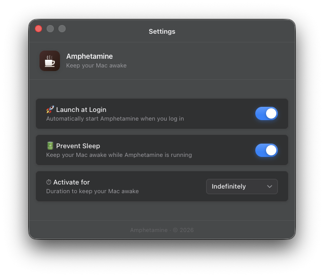

# Amphetamine

A macOS menu bar app that keeps your Mac awake. Lives in the system tray, prevents the system from going to sleep, and stays out of the Dock.

## Features

- **Sleep Prevention**: blocks system and display sleep via Electron's `powerSaveBlocker` (`prevent-display-sleep`).
- **Session Timer**: start timed sessions (configurable duration) or run indefinitely. Runtime state uses monotonic `performance.now()`; timed sessions also keep a wall-clock anchor so expiry survives macOS sleep.
- **Battery-Aware Auto-Disable**: polls `pmset` and automatically stops sleep prevention when battery drops below a configurable threshold.
- **Global Shortcut**: toggle sleep prevention with `Cmd+Shift+A` (configurable).
- **Launch at Login**: optional macOS login item, managed through native APIs.
- **Tray-Only UX**: no Dock icon by default (`LSUIElement`). The settings window appears in the Dock only while open.
- **Settings Window**: configure launch-at-login, sleep prevention default, session duration, battery threshold, and the keyboard shortcut.
- **Auto-Updater**: checks GitHub releases via `electron-updater` shortly after launch and every 4 hours, with exponential backoff up to 24h on failure. Manual "Check for Updates" available from the tray menu.
- **Secure IPC**: sandboxed preload exposes a strictly typed `window.api` bridge. Main-side handlers validate sender origin against an allowlist; all 15 channels are typed end-to-end.

## Screenshots



_Configure launch-at-login, sleep prevention, session duration, battery threshold, and keyboard shortcut._

## Requirements

- macOS 11 or later (Apple Silicon arm64 or Intel x64)
- Bun ≥ 1.3.14 (recommended) or Node.js ≥ 22

## Development

```bash
bun install
bun run dev               # Dev orchestration: rslib watch (main + preload) + rsbuild dev server + Electron
bun run build             # Build all processes (main + preload + renderer)
bun run build:main        # Build main process only (rslib)
bun run build:preload     # Build preload only (rslib)
bun run build:renderer    # Build renderer only (rsbuild)
bun run typecheck         # tsc -b for src/
bun run typecheck:tests   # tsc for tests/
bun run test              # Run Vitest workspace (~391 tests across 23 files)
bun run test:watch        # Vitest in watch mode
bun run test:coverage     # Vitest with v8 coverage
bun run lint              # ESLint over src/ tests/
bun run lint:fix          # ESLint with --fix
bun run format            # Prettier write
bun run clean             # Remove lib/ and dist/
```

### Dev Orchestration

`bun run dev` (`scripts/dev.ts`) starts three build processes in parallel:

1. `rslib` watch for the main process → `lib/main/index.cjs`
2. `rslib` watch for the preload → `lib/preload/index.cjs`
3. `rsbuild` dev server for the renderer on `http://localhost:5173` (two entry points: main popover + settings window)

It waits until both CJS outputs exist on disk and the renderer's TCP port is accepting connections, then launches Electron with `--disable-gpu-sandbox`.

## Build & Packaging

Packaging is handled by `electron-builder`, configured in `electron-builder.yml`. Build resources (icon, entitlements, after-pack hook, fuse flipper) live under `build/`.

```bash
bun run package             # arm64 DMG + ZIP, then flip Electron fuses
bun run package:x64         # Intel x64 DMG + ZIP
bun run package:universal   # Universal (arm64 + x64) DMG + ZIP
bun run package:dir         # Unpacked .app directory only (faster, for local testing)
bun run flip-fuses arm64    # Apply fuses manually if needed
```

Outputs are written to `dist/` (e.g. `Amphetamine-1.7.5-arm64.dmg`, `Amphetamine-1.7.5-arm64-mac.zip`).

For local DMG builds, `./build-macOS-dmg.sh --arch arm64 --environment prd` wraps the same build, handles ad-hoc signing when no Developer ID certificate is available, and appends the environment suffix to the DMG name.

Notes on packaging:

- **Tray agent**: `LSUIElement` is set so the app does not appear in the Dock or app switcher.
- **Hardened runtime is intentionally disabled** and the app is **not notarized**. Electron's V8 renderer requires JIT and unsigned executable memory; enabling hardened runtime without notarization would cause Gatekeeper to reject the app for most users.
- **Fuses**: after packaging, `build/flip-fuses.cjs` disables `RunAsNode` and enables cookie encryption + ASAR integrity checks.
- **Targets**: DMG (`ULFO` format) and ZIP for both `arm64` and `x64`. Minimum macOS 11.
- **Updates**: published to GitHub releases (`OCWorkforces/Amphetamine`).

### Install to Applications

1. Open the DMG from `dist/`.
2. Drag **Amphetamine.app** into **Applications**.
3. Eject the DMG.

### Troubleshooting Security Warnings

Because builds are not notarized, macOS may show "cannot be opened because it is from an unidentified developer".

**Option 1: Remove quarantine attribute**

```bash
sudo xattr -rd com.apple.quarantine "/Applications/Amphetamine.app"
```

**Option 2: System Settings**

1. Open **System Settings** → **Privacy & Security**.
2. Find the security warning for Amphetamine.
3. Click **Open Anyway**, then **Open** in the dialog.

**Option 3: Right-click open**

1. Right-click (or Control-click) **Amphetamine.app**.
2. Select **Open**, then confirm.

### App Won't Start / Crashes on Launch

1. **Check Console logs:**

   ```bash
   log stream --predicate 'process == "Amphetamine"' --level debug
   ```

2. **Re-sign the app bundle (ad-hoc):**

   ```bash
   codesign --force --deep --sign - "/Applications/Amphetamine.app"
   ```

3. **Reinstall:**

   ```bash
   rm -rf "/Applications/Amphetamine.app"
   # Then reinstall from the DMG
   ```

## Project Structure

```
Amphetamine/
├── src/
│   ├── main/        # Electron main process: tray, IPC, settings, session timer,
│   │                # sleep prevention, battery monitor, global shortcut, auto-updater
│   ├── preload/     # Sandboxed context bridge exposing typed window.api
│   ├── renderer/    # Vanilla TS UI (popover + settings window, two rsbuild entries)
│   ├── assets/      # Generated tray icons and settings hero image packaged at runtime
│   └── shared/      # Cross-process types, IPC channel map, settings validators
├── tests/           # Vitest workspace (main + renderer projects)
├── scripts/         # dev orchestration + icon generators
├── build/           # electron-builder resources (icon, entitlements, hooks, fuses)
├── rslib.config.ts          # Main process build
├── rslib.config.preload.ts  # Preload build
├── rsbuild.config.ts        # Renderer build (two envs)
├── electron-builder.yml
└── vitest.workspace.ts
```

## Tech Stack

| Layer       | Tech                                             |
| ----------- | ------------------------------------------------ |
| Runtime     | Electron 42                                      |
| Language    | TypeScript 6.0 (strict, ESM source → CJS output) |
| Build       | Rslib (main + preload), Rsbuild (renderer)       |
| Package Mgr | Bun 1.3.14 (`engines`: Bun ≥ 1.3.14, Node ≥ 22)  |
| Test        | Vitest 4 workspace (~391 tests across 23 files)  |
| Lint/Format | ESLint 10 (flat config) + Prettier 3             |
| UI          | Vanilla TypeScript, no UI framework              |
| Updates     | electron-updater (GitHub provider)               |

## Testing & Linting

- `bun run test` runs the Vitest workspace with two projects: `main/` (Node env, Electron mocked via `vi.hoisted`) and `renderer/` (jsdom).
- ESLint flat config enforces strict rules: `no-explicit-any`, `no-floating-promises`, `strict-boolean-expressions`, `consistent-type-imports` (all `error`).
- TypeScript runs in strict mode with `exactOptionalPropertyTypes`, `verbatimModuleSyntax`, `noUncheckedIndexedAccess`, `noImplicitOverride`, and `noImplicitReturns`.

## Contact

Questions or issues? Reach out at [kennydizi@ocworkforces.com](mailto:kennydizi@ocworkforces.com).

## License

Unlicense
